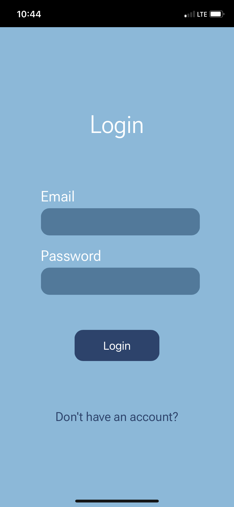
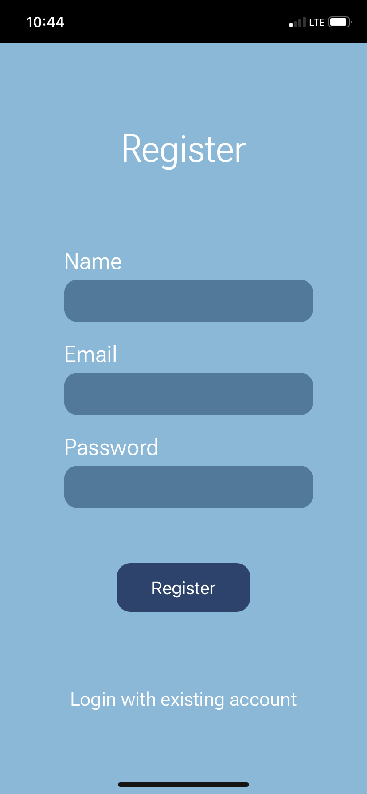
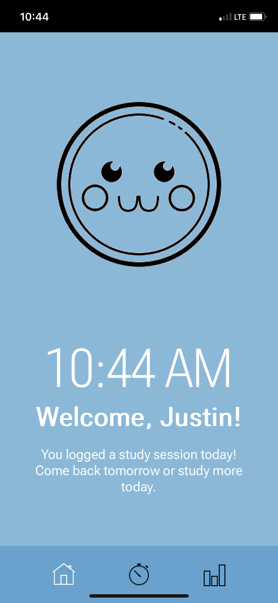
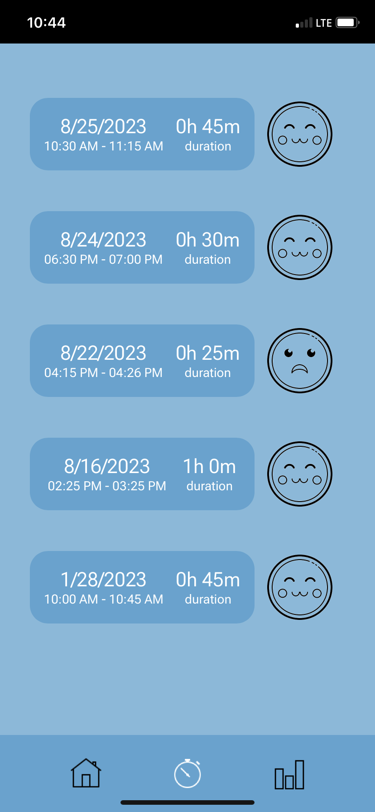
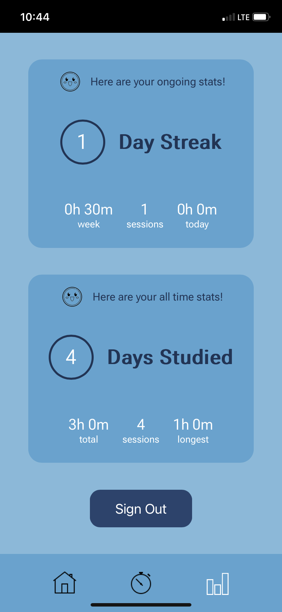

# Taumy Study Buddy

Web application tracker for Taumy, a Pomodoro study  device. Allows user to login to their account and view daily progress, previous study sessions, and overall statistics from using Taumy.

Built using the MERN stack and [deployed](https://taumy-study.onrender.com/) on Render!

 

  
